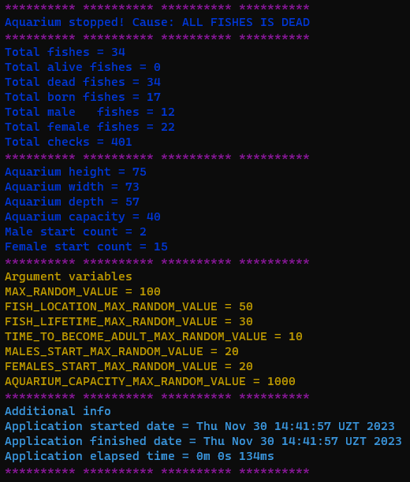
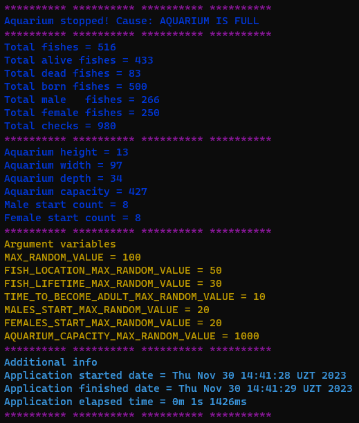

# Решение тестового задания из компании - "_Furor Progress_"
## Задача:
### Аквариум
Том подарил своему брату Алексу на день рождения аквариум с рыбками. Через
несколько дней Том сам заинтересовался рыбками и купил себе аквариум с рыбками.
Но у Тома не было достаточно свободного времени, чтобы ухаживать за рыбками.
Поэтому Том решил создать программу, которая будет записывать каждый процесс,
происходящий в аквариуме, и обратился к вам за помощью. **Ваша задача - помочь Тому создать программу.**
#### Требования к программе:
- Все значения должны определяться случайным образом.(**Random**)
- Следует использовать коллекции.(**Collections**)
- Каждая рыба должна быть в отдельном потоке.(**Thread**)
- Отчет о каждом процессе должен отображаться в консоли.(**Console**)
- На момент написания в аквариуме было **N** самцов и **M** самок. Значения **N** и **M**
  также определяются методом **Random**.
- У каждой рыбы своя продолжительность жизни, и ее длина определяется
  методом **Random**.
- Если самцы и самки встречаются, они должны размножаться. Пол каждой
  новорожденной рыбы определяется методом **Random**.

#### Дополнительные требования:
* У аквариума должен быть размер (высота, длина, ширина).
* У аквариума должно быть определенное максимальное количество рыб (определяется методом **Random**).
* При доситижении количества рыб максимальному -> **аквариум должен выключится**.
* Если все рыбки погибнут -> **аквариум должен выключится**.
* Рыбы будут передвигаться, и если координаты двух рыб разных полов совпадут, то появляется новая рыбка.

## Результат работы программы:

 
 

